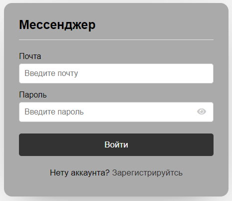
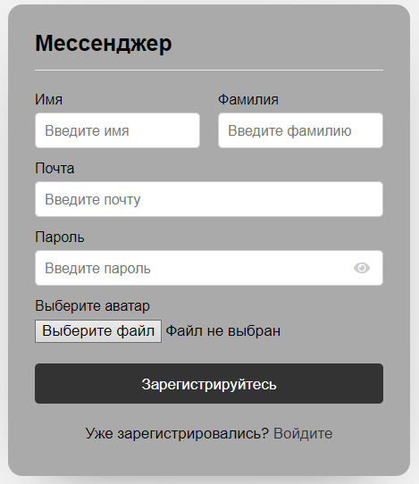
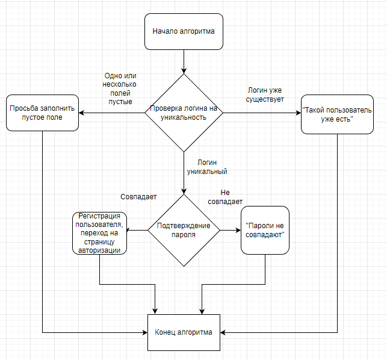
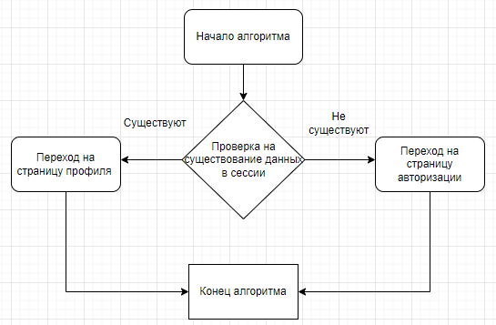
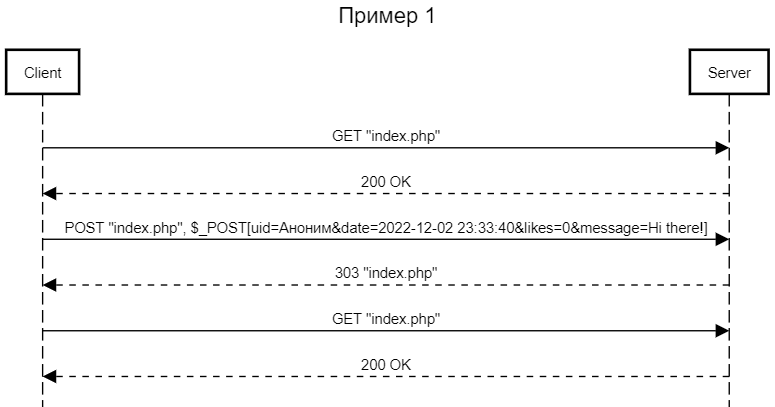
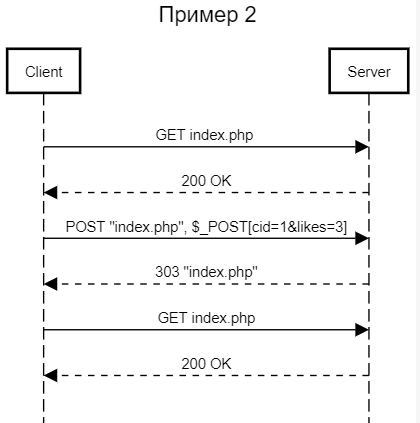

# Отчет по лабораторной работе №3
## "Изучение технологии AJAX"
## по курсу "Основы программирования"
### *Работу выполнил студент группы №3131 Беляев Дмитрий*

#### Цель работы:

Разработать и реализовать анонимный чат с возможностью создания каналов. В интерфейсе отображается несколько каналов, пользователь может либо подключиться к существующему, либо создать новый. Сообщения доставляются пользователю без обновления страницы.

#### Пользовательский интерфейс:

* Форма входа:

* Форма регистрации:

#### Пользовательские сценарии работы:

1. Пользователь вводит в адресной строке index.php и попадает на форму регистрации. После регистрации пользователь попадает на страницу с каналами.
2. Выбрав канал, пользователь попадает на страницу сhat.php с определенным пользователем.
3. Дальше пользователь может написать и отправить его. Также виден статус пользователя.

#### API:

Сервер работает с помощью POST-запросов и AJAX-запросов.   

#### Хореография:

index.php, при отсутствии переменной $_SESSION['user'], перенаправляет пользователя на страницу auth.php. Если переменная есть, то перенаправление не происходит. При нажатии на кнопку выйти сервер отправляет запрос в logout.php (в результате запроса переменная $_SESSION['user']) будет уничтожена и направляет пользователя на auth.php.

Со страницы auth.php, при нажатии кнопки "Регистрация", сервер отправляет запрос на signup.php (тут данные будут проверены и, если всё ок, внесены в БД), передавая туда введённые в поля "Имя", "Фамилия", "Почта", "Пароль"  и "Аватар" данные. signup.php после обработки данных возвращает индикатор, в зависимости от значения которого будет выведено сообщение об ошибке или успешной регистрации.

При нажатии на странице auth.php кнопки "Login now", сервер направит на signin.php запрос с введёнными данными. signin.php проверяет данные на корректность и возвращает индикатор, в зависимости от значения которого будет выведено сообщение об ошибке или пользователь получит переменную $_SESSION['user']) и будет перенаправлен на index.php.

Со страницы index.php, при нажатии на пользователя которому ты хочешь написать сообщение, перенаправляет пользователя на страницу chat.php. chat.php отправляет запрос на добавление нового сообщения.

#### Структура базы данных:

Используются две таблицы:

- Таблица messages:

1. msg_id - уникальный идентификатор сообщения типа int

2. incoming_msg_id - идентификатор получателя типа int

3. outgoing_msg_id - идентификатор отправителя типа int

4. msg - сообщение типа varchar

- Таблица users:

1. user_id - количество идентификаторов пользователей типа int

2. unique_id - уникальный идентификатор пользователя типа int

3. fname - имя типа varchar

4. lname - фамилия типа varchar

5. email - почта типа varchar

6. password - пароль типа varchar

7. img - изображение типа varchar

8. status - онлайн/оффлайн типа varchar

#### Алгоритмы работы:

* Алгоритм работы для форм регистрации:

* Алгоритм работы для форм авторизации:

#### Примеры HHTP запросов/ответов

* Пример 1                          

* Пример 2                                 

